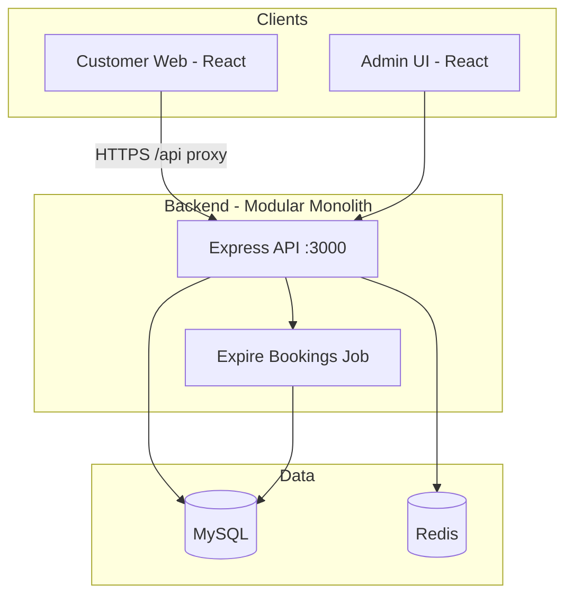
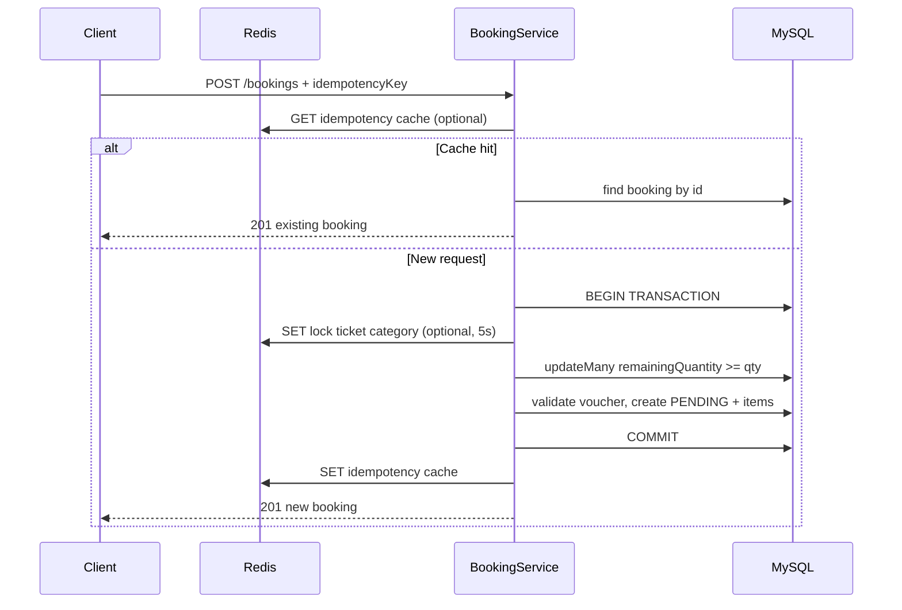
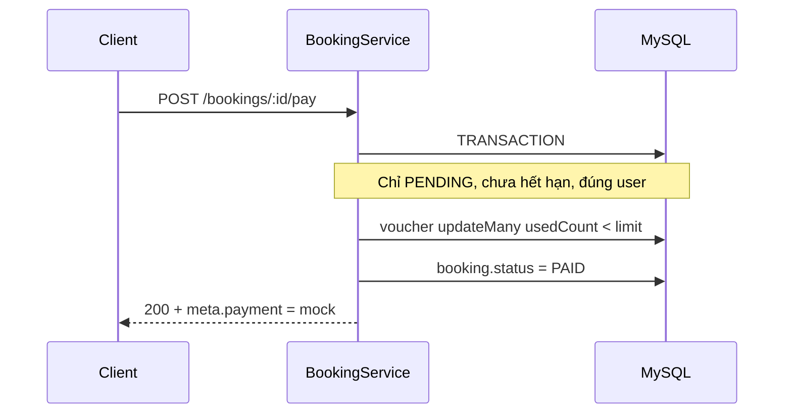
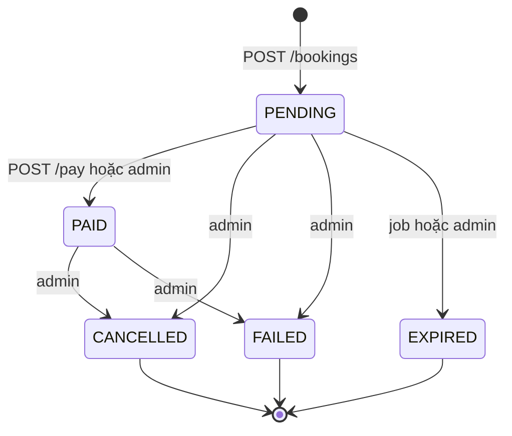

# Tài liệu thiết kế hệ thống

> Bài kiểm tra: **Product Backend Engineer Test** — Nền tảng đặt vé ca nhạc (Event Ticket Booking)  
> Mục tiêu: thiết kế kiến trúc phù hợp flash sale (~50.000 user, peak ~300–500 booking/phút), chống overselling, trùng đơn, lạm dụng voucher.

---

## 1. Tổng quan bối cảnh

| Yêu cầu kinh doanh | Giải pháp kỹ thuật |
|---------------------|-------------------|
| Duyệt concert, xem hạng vé | API `GET /concerts`, frontend React |
| Đặt giữ chỗ + voucher | `POST /bookings` (trạng thái `PENDING`, trừ tồn kho) |
| Theo dõi đặt chỗ | `GET /bookings/me`, `GET /bookings/:id` |
| Thanh toán | **Mock** — `POST /bookings/:id/pay` → `PAID` |
| Dashboard vận hành | API `/admin/*` (JWT role `ADMIN` / `OPERATOR`) |
| Flash sale ổn định | Atomic inventory, idempotency, Redis rate limit / lock |

---

## 2. Quyết định kiến trúc chính

### 2.1 Modular Monolith (không microservice)

**Lý do chọn:**

- Startup cần ra mắt nhanh; một codebase, một process deploy, debug đơn giản.
- Peak ~5–8 req/s đặt vé — monolith Node.js + MySQL + connection pool đủ cho quy mô đề bài.
- Domain gắn chặt (concert, booking, voucher) — transaction xuyên module dễ hơn so với distributed transaction.

**Trade-off:** Khi scale 10x+, tách read path (cache concert), scale API ngang, có thể tách service inventory sau; hiện tại **MySQL là nguồn sự thật duy nhất** cho tồn kho.

### 2.2 Stack

| Thành phần | Công nghệ | Vai trò |
|------------|-----------|---------|
| API | Node.js 20+, Express 5 | REST, middleware, Swagger |
| ORM | Prisma 7 + MariaDB adapter | Schema, migrations, transactions |
| DB | MySQL 8 (Docker) | Dữ liệu bền, ACID |
| Cache / limit | Redis 7 (Docker, optional) | Rate limit, idempotency cache, lock ngắn |
| Auth | JWT (jsonwebtoken) | Customer + Admin |
| Frontend | React + Vite + TypeScript | UI demo, proxy `/api` → backend |
| Docs | OpenAPI 3 + Postman | Kiểm thử local |

**Vì sao MySQL thay vì PostgreSQL:** Đề không bắt buộc; team quen MySQL/MariaDB, Prisma hỗ trợ tốt, `UPDATE ... WHERE remaining_quantity >= n` đủ cho chống oversell.

**Vì sao Redis:** Không bắt buộc cho correctness — hệ thống vẫn đúng nếu Redis tắt (`REDIS_ENABLED=false`). Redis giảm contention và tăng tốc idempotency lookup trong flash sale.

### 2.3 Không triển khai (cố ý)

- Payment gateway thật, webhook PSP
- Kafka, Kubernetes, CQRS, event sourcing
- Chọn ghế (seat map)
- Email/SMS, observability production-grade

---

## 3. Sơ đồ kiến trúc

### 3.1 Context (C4 Level 1)



### 3.2 Cấu trúc module

```
backend/src/
├── app.js                 # Bootstrap, routes, Swagger, job
├── common/
│   ├── prismaClient.js    # Singleton Prisma
│   └── errorHandler.js    # Chuẩn hóa lỗi JSON
├── config/
│   ├── openapi.json       # Swagger spec
│   └── swagger.js
├── infrastructure/
│   └── redis.js           # Kết nối Redis, fallback graceful
├── middleware/
│   └── rateLimit.js       # POST /bookings — 30 req / 15 phút / IP
├── jobs/
│   └── expireBookings.js  # PENDING quá hạn → EXPIRED + hoàn kho
└── modules/
    ├── auth/              # Register, login, JWT middleware
    ├── concert/           # Public: concert đã PUBLISHED
    ├── booking/           # Core: create, mock pay, inventory
    ├── voucher/           # Validate voucher (customer)
    └── admin/             # Concert, voucher, booking management
```

**Nguyên tắc phân lớp:**

- **Routes:** mount middleware, không logic nghiệp vụ
- **Controller:** parse request/response
- **Service:** business rules, transactions
- **Infrastructure:** Redis, không import từ controller

---

## 4. Luồng nghiệp vụ quan trọng

### 4.1 Đặt vé (Create Booking)



**Trạng thái sau bước này:** `PENDING`, `expiresAt` = now + **15 phút**, tồn kho đã trừ.

### 4.2 Thanh toán giả lập (Mock Pay)



**Quan trọng:** `voucher.usedCount` chỉ tăng khi **PAID**, không tăng lúc `PENDING` — tránh “giữ” slot voucher khi user không thanh toán.

### 4.3 Hết hạn giữ chỗ (Background Job)

- Chạy mỗi **60 giây** khi server start (`startExpireBookingsJob`).
- Tìm `PENDING` có `expiresAt < now` → `EXPIRED` + `releaseBookingInventory` (cộng lại `remainingQuantity`).

### 4.4 Admin cập nhật trạng thái thủ công

- `PATCH /admin/bookings/:id/status` với state machine rõ ràng.
- Chuyển sang `CANCELLED` / `FAILED` / `EXPIRED` từ `PENDING` hoặc `PAID` → hoàn kho (và hoàn `usedCount` voucher nếu đã `PAID`).

---

## 5. Chống rủi ro flash sale

| Rủi ro | Cơ chế | Ghi chú |
|--------|---------|---------|
| **Overselling** | `ticketCategory.updateMany({ where: { remainingQuantity: { gte: qty } }, data: { decrement } })` trong transaction | Không dùng read-then-write ngoài transaction |
| **Duplicate booking (retry)** | `idempotencyKey` UNIQUE trên DB + Redis cache + xử lý `P2002` | Client gửi cùng key khi retry |
| **Lạm dụng voucher** | Validate lúc book; `usedCount++` chỉ lúc pay với `updateMany` điều kiện | Không trừ usage khi chỉ PENDING |
| **Traffic spike** | Rate limit `POST /bookings`: 30 req / 15 phút / IP (Redis store hoặc memory) | Bảo vệ DB, không thay thế inventory lock |
| **Contention hot tier** | Redis lock per `ticketCategoryId` (TTL 5s, optional) | Giảm thundering herd; DB vẫn là chốt cuối |

### 5.1 Vì sao không dùng pessimistic `FOR UPDATE`?

- **Atomic `updateMany` + kiểm tra `count === 1`:** Đơn giản, ít deadlock, dễ giải thích trong phỏng vấn, đủ chính xác cho inventory dạng số lượng.
- **Pessimistic lock:** Hợp lệ nhưng có thể serialize quá mức trên nhiều category; vẫn có thể kết hợp sau nếu cần.

### 5.2 Transaction boundary

| Thao tác | Trong transaction? |
|----------|-------------------|
| Trừ tồn kho + tạo booking PENDING | Có |
| Mock pay + tăng voucher usedCount | Có |
| Expire job từng booking | Có (từng booking) |
| Redis idempotency cache | Không (best-effort sau commit) |

---

## 6. State machine — Booking



| Status | Ý nghĩa | Tồn kho |
|--------|---------|---------|
| `PENDING` | Đã giữ vé, chờ thanh toán mock | Đã trừ |
| `PAID` | Thanh toán mock thành công | Vẫn trừ |
| `EXPIRED` | Quá 15 phút chưa pay | Đã hoàn |
| `CANCELLED` | Hủy thủ công | Hoàn nếu từ PENDING/PAID |
| `FAILED` | Đơn nghi vấn / lỗi | Hoàn theo rule admin |

Enum `RESERVED` có trong schema để mở rộng sau; luồng hiện tại dùng `PENDING`.

---

## 7. Bảo mật & vận hành

- **Helmet** + **CORS** + **Morgan** logging
- **JWT** trên route protected; admin routes cần `ADMIN` hoặc `OPERATOR`
- **Không** lưu thẻ / PCI — payment 100% mock
- **Health:** `GET /health`
- **Secrets:** `.env` không commit; xem `.env.example`

---

## 8. Hướng mở rộng (nếu traffic x10)

1. **Read:** Cache danh sách concert `PUBLISHED` trên Redis (TTL ngắn).
2. **Write:** Hàng đợi booking (SQS/RabbitMQ) + worker xử lý transaction — API chỉ enqueue.
3. **DB:** Read replica cho browse; primary cho booking.
4. **Inventory service:** Tách module tồn kho nếu nhiều sự kiện đồng thời.
5. **Outbox pattern:** Gửi email/xác nhận sau commit (chỉ mô tả, chưa implement).

---

## 9. Liên kết tài liệu khác

- [Thiết kế CSDL](DATABASE.md)
- [API Reference](API.md)
- [Hướng dẫn chạy local](LOCAL_SETUP.md)
- [Giả định & phạm vi](ASSUMPTIONS.md)
- [Coding guidelines](CODING_GUIDELINES.md)
