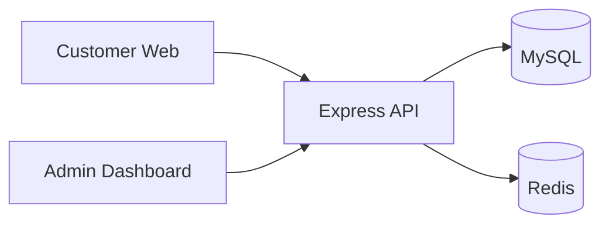
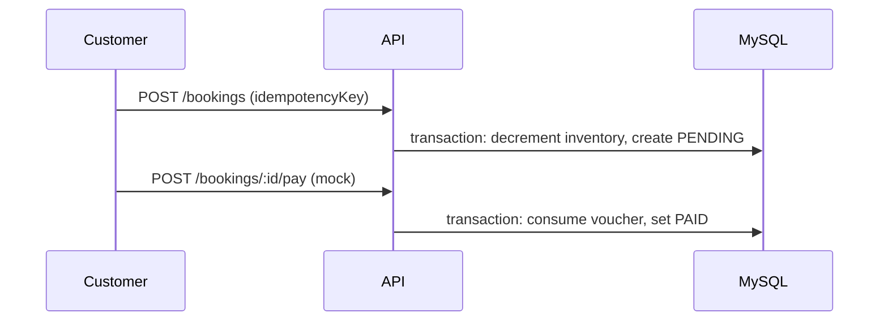

# System Architecture

## Context



## Modular monolith

```
backend/src/
├── modules/
│   ├── auth/
│   ├── concert/
│   ├── booking/      # core: reserve, mock pay, idempotency
│   ├── voucher/
│   └── admin/
├── infrastructure/   # Redis client
├── jobs/             # expire PENDING bookings
└── middleware/       # rate limit
```

## Booking flow



## Concurrency (flash sale)

| Risk | Mitigation |
|------|------------|
| Overselling | Atomic `updateMany` with `remainingQuantity >= qty` inside DB transaction |
| Duplicate orders | Unique `idempotencyKey` + Redis cache fast-path |
| Voucher abuse | `usedCount` incremented only on mock pay with conditional update |
| Traffic spike | Redis rate limit on `POST /bookings`; optional per-category lock |

Peak target from brief: ~300–500 bookings/minute (~5–8 req/s) — monolith + connection pooling is sufficient at this scale; horizontal scaling would add read replicas and API instances behind a load balancer.

## Payment

**Not implemented:** payment gateways, webhooks, PCI, card storage.

**Implemented:** `POST /bookings/:id/pay` mock endpoint and UI **Pay money** button.

## Scaling notes (10x traffic)

- Read-heavy: cache published concerts in Redis.
- Write-heavy: shard by `concertId`, queue booking requests, outbox for notifications.
- Keep inventory authority in MySQL (or dedicated inventory service) — do not rely on cache alone.
