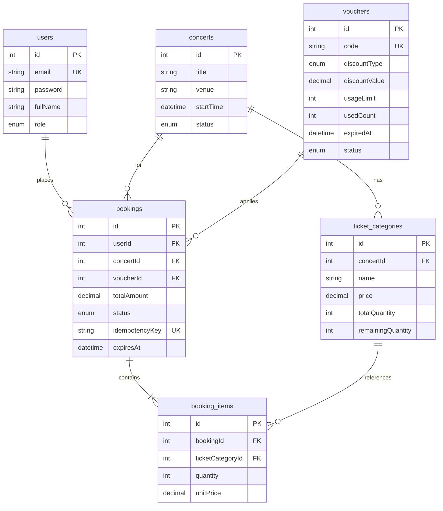

# Database Design

## ERD

## Booking status

| Status | Meaning |
|--------|---------|
| PENDING | Reserved, awaiting mock payment |
| PAID | Mock payment completed |
| CANCELLED | Manually cancelled, inventory restored |
| EXPIRED | Hold timed out, inventory restored |
| FAILED | Marked failed by admin |

## Indexes

- `bookings.idempotencyKey` — UNIQUE (retry safety)
- `users.email` — UNIQUE
- `vouchers.code` — UNIQUE
- Consider composite index on `bookings(status, expiresAt)` for expiry job

## Inventory rule

`remainingQuantity` is decremented on booking create (`PENDING`) and restored on `CANCELLED` / `EXPIRED` / `FAILED` (from `PENDING` or `PAID` as per transition rules).
