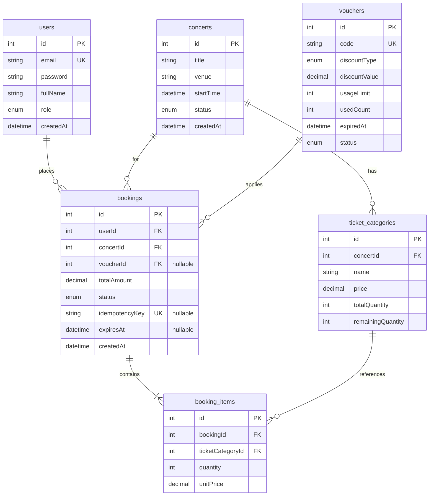
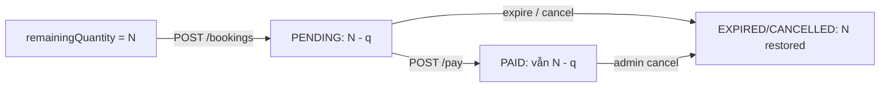

# Tài liệu thiết kế cơ sở dữ liệu

> MySQL 8 qua Docker, ORM Prisma 7. Tài liệu mô tả **thiết kế**, **ràng buộc** và **lý do** phục vụ flash sale & booking.

---

## 1. Phân tích yêu cầu → mô hình dữ liệu

| Nhu cầu nghiệp vụ | Thự thể / trường |
|-------------------|------------------|
| Khách đăng ký / admin vận hành | `users` + `role` |
| Sự kiện, trạng thái ra mắt | `concerts.status` |
| Nhiều hạng vé, số lượng | `ticket_categories` + `remainingQuantity` |
| Chiến dịch giảm giá | `vouchers` + `usedCount` / `usageLimit` |
| Một đơn = một concert | `bookings.concertId` |
| Chống retry trùng đơn | `bookings.idempotencyKey` UNIQUE |
| Giữ chỗ có thời hạn | `bookings.expiresAt` |
| Chi tiết từng loại vé trong đơn | `booking_items` |

**Giả định thiết kế:** Không chọn ghế cụ thể — chỉ đếm số lượng theo `ticket_category`. Đơn giản hóa schema và logic concurrency.

---

## 2. ERD (Entity Relationship Diagram)



---

## 3. Chi tiết bảng

### 3.1 `users`

| Cột | Kiểu | Mô tả |
|-----|------|--------|
| `id` | INT PK AI | |
| `email` | VARCHAR UNIQUE | Đăng nhập |
| `password` | VARCHAR | bcrypt hash |
| `fullName` | VARCHAR | |
| `role` | ENUM | `CUSTOMER`, `OPERATOR`, `ADMIN` |
| `createdAt` | DATETIME | |

### 3.2 `concerts`

| Cột | Kiểu | Mô tả |
|-----|------|--------|
| `status` | ENUM | `DRAFT`, `PUBLISHED`, `SOLD_OUT` |
| `startTime` | DATETIME | Thời gian diễn |

Chỉ concert `PUBLISHED` mới cho phép `POST /bookings`.

### 3.3 `ticket_categories`

| Cột | Kiểu | Mô tả |
|-----|------|--------|
| `totalQuantity` | INT | Tổng phát hành (lịch sử) |
| `remainingQuantity` | INT | **Tồn kho khả dụng** — cột quan trọng nhất cho anti-oversell |

**Quy tắc tồn kho:**

- Tạo booking `PENDING`: `remainingQuantity -= quantity` (trong transaction, có điều kiện `>= quantity`).
- `EXPIRED` / `CANCELLED` / `FAILED` (từ trạng thái đang giữ kho): `remainingQuantity += quantity`.
- Admin tăng `totalQuantity`: có thể tăng `remainingQuantity` tương ứng (xem `admin.concert.service`).

### 3.4 `vouchers`

| Cột | Kiểu | Mô tả |
|-----|------|--------|
| `discountType` | ENUM | `PERCENTAGE`, `FIXED` |
| `discountValue` | DECIMAL(10,2) | % hoặc số tiền |
| `usageLimit` | INT | Số lần dùng tối đa |
| `usedCount` | INT | Đã dùng (chỉ tăng khi booking `PAID`) |
| `status` | ENUM | `ACTIVE`, `INACTIVE`, `EXPIRED` |

### 3.5 `bookings`

| Cột | Kiểu | Mô tả |
|-----|------|--------|
| `totalAmount` | DECIMAL | Sau giảm giá voucher |
| `idempotencyKey` | VARCHAR UNIQUE | Bắt buộc khi tạo qua API |
| `expiresAt` | DATETIME | TTL giữ chỗ 15 phút (`PENDING`) |

### 3.6 `booking_items`

Lưu **snapshot** `unitPrice` tại thời điểm đặt — giá concert có thể đổi sau này mà đơn cũ vẫn đúng.

---

## 4. Enums

### BookingStatus

| Giá trị | Ý nghĩa |
|--------|---------|
| `PENDING` | Đã giữ vé, chờ mock pay |
| `PAID` | Đã thanh toán mock |
| `CANCELLED` | Hủy (admin / nghiệp vụ) |
| `EXPIRED` | Hết thời gian giữ |
| `FAILED` | Đánh dấu lỗi / nghi vấn |
| `RESERVED` | Dự phòng mở rộng (chưa dùng trong flow chính) |

### ConcertStatus

`DRAFT` → `PUBLISHED` → có thể `SOLD_OUT` (manual hoặc khi hết vé).

---

## 5. Indexes & ràng buộc

| Index / ràng buộc | Mục đích |
|-------------------|----------|
| `users.email` UNIQUE | Một tài khoản / email |
| `vouchers.code` UNIQUE | Tra cứu mã nhanh |
| `bookings.idempotencyKey` UNIQUE | Idempotent create |
| FK `booking_items` → `bookings`, `ticket_categories` | Toàn vẹn tham chiếu |

**Đề xuất production (chưa migration):**

```sql
CREATE INDEX idx_bookings_status_expires ON bookings(status, expiresAt);
CREATE INDEX idx_bookings_user_created ON bookings(userId, createdAt DESC);
```

Phục vụ job expire và `GET /bookings/me`.

---

## 6. Luồng dữ liệu tồn kho



**Invariant:** Tổng vé đã bán (PAID, chưa hoàn) + `remainingQuantity` ≤ `totalQuantity` (khi không có admin chỉnh tay sai).

---

## 7. Công thức giá & voucher

```
subtotal = Σ (unitPrice × quantity)   // unitPrice từ ticket_category lúc đặt
discount = PERCENTAGE ? subtotal × value/100 : value
totalAmount = max(0, subtotal - discount)
```

Voucher validate lúc tạo booking; usage count chỉ commit lúc `PAID`.

---

## 8. Migration & seed

```bash
cd backend
npx prisma migrate deploy    # áp dụng migrations/
npm run db:seed              # admin, customer, concert mẫu, FLASH10
```

**Seed mặc định:**

| Entity | Giá trị |
|--------|---------|
| Admin | `admin@demo.com` / `password123` |
| Customer | `customer@demo.com` / `password123` |
| Concert | Summer Flash Sale Concert — VIP + Standard |
| Voucher | `FLASH10` — 10%, limit 100 |

---

## 9. Trade-off thiết kế CSDL

| Quyết định | Lợi | Hạn chế |
|------------|-----|---------|
| `remainingQuantity` denormalized | Update atomic đơn giản | Cần job/admin đồng bộ khi hoàn trả |
| Không bảng `payments` | Phù hợp mock pay | Tích hợp PSP sau phải thêm bảng + webhook |
| `idempotencyKey` trên booking | Retry an toàn | Client phải generate UUID |
| Snapshot `unitPrice` | Lịch sử đơn chính xác | Dư dữ liệu nhỏ trên mỗi item |

---

## 10. File schema

Định nghĩa đầy đủ: `backend/prisma/schema.prisma`  
Migration khởi tạo: `backend/prisma/migrations/`
